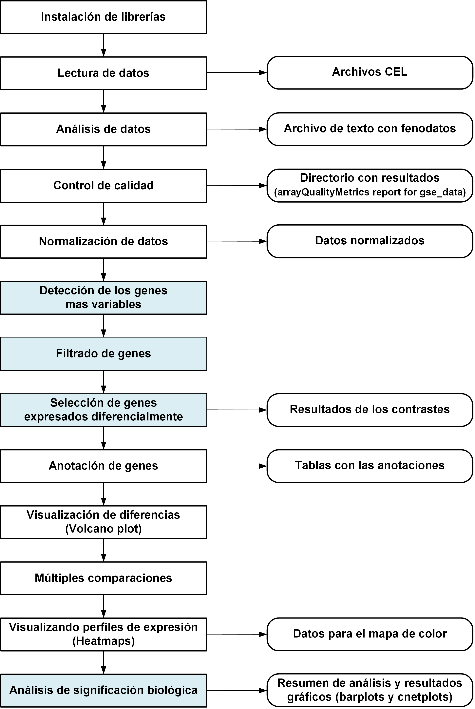
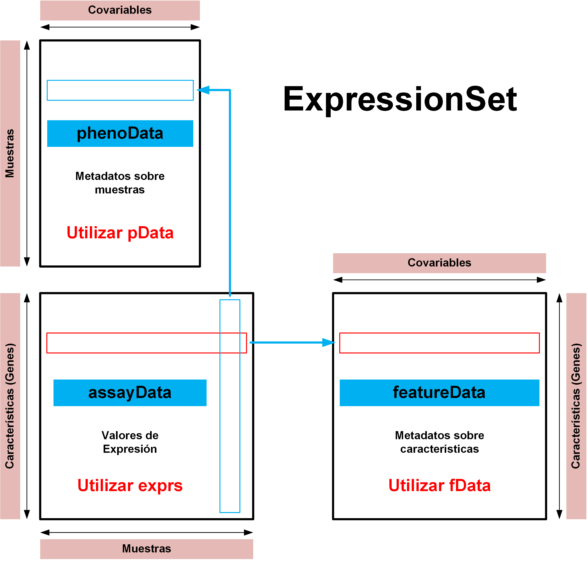

```{r setup, include=FALSE}
library(knitr)
knitr::opts_chunk$set(echo = TRUE, message = FALSE, warning = FALSE, 
                      comment = NA, prompt = TRUE, tidy = FALSE, 
                      fig.width = 7, fig.height = 7, fig_caption = TRUE,
                      cache=FALSE)
Sys.setlocale("LC_TIME", "C")
```

```{r echo=FALSE}
if(!(require(printr))) {
  install.packages(
    'printr',
    type = 'source',
    repos = c('http://yihui.name/xran', 'http://cran.rstudio.com'))
}
```


# Resumen

Este informe presenta los resultados del estudio de los datos de microarrays obtenidos por el Ovarian Cancer Institute (Atlanta) a partir de pacientes de cáncer de ovario tratados con quimioterapia. El informe ha sido organizado de acuerdo con el procedimiento a seguir en un estudio de microarrays de un solo color. Los datos del estudio se encuentran en la base de datos Gene Expression Omnibus [(GEO)](https://www.ncbi.nlm.nih.gov/geo/) con el código GSE7463. El resumen del estudio tal como aparece en **GEO** es el siguiente:

Gene expression profiles of malignant carcinomas surgically removed from ovarian cancer patients pre-treated with chemotherapy (neo-adjuvant) prior to surgery group into two distinct clusters. One group clusters with carcinomas from patients not pre-treated with chemotherapy prior to surgery (C-L) while the other clusters with non-malignant adenomas (A-L). Although the C-L cluster is preferentially associated with p53 loss-of-function (LOF) mutations, the C-L cluster cancer patients display a more favorable clinical response to chemotherapy as evidenced by enhanced long-term survivorships. A set of 43 ovarian tumors was obtained from the Ovarian Cancer Institute (Atlanta). Tissue was collected at the time of surgery and preserved in RNAlater (Ambion, Austin, TX) within one minute of collection. Labeled probe was hybridized to the Affymetrix HG-U95Av2 arrays.


# Introducción


```{r fig.cap='Figura 1. Procedimiento para análisis de datos de microarrays.', echo=FALSE}

```

# Instalación de librerías

```{r installPackages, message=FALSE, echo=FALSE, warning=FALSE, eval=FALSE}
install.packages("knitr")
install.packages("colorspace")
install.packages("gplots")
install.packages("ggplot2")
install.packages("ggrepel")
install.packages("htmlTable")
install.packages("prettydoc")
install.packages("devtools")
install.packages("BiocManager")
BiocManager::install("Biobase")
BiocManager::install("GEOquery")
BiocManager::install("oligo")
BiocManager::install("pd.mogene.2.1.st")
BiocManager::install("arrayQualityMetrics")
BiocManager::install("pvca")
BiocManager::install("limma")
BiocManager::install("genefilter")
BiocManager::install("annotate")
BiocManager::install("org.Mm.eg.db")
BiocManager::install("ReactomePA")
BiocManager::install("reactome.db")
BiocManager::install("hgu95av2.db")
```


# Lectura de datos


```{r fig.cap='Figura 2. Organización de datos con expressioSet.', echo=FALSE}

```


### Aplicación de GEOquery


```{r echo=FALSE}
library(Biobase)
library(GEOquery)
```


```{r echo=FALSE}
my.gse <- "GSE7463"
if(!file.exists("datos"))       dir.create("datos")
if(!file.exists("resultados"))  dir.create("resultados", recursive=TRUE)
gse_datos <- getGEO(GEO=my.gse, filename=NULL, destdir="./datos", 
                    GSElimits=NULL, GSEMatrix=TRUE, AnnotGPL=FALSE, 
                    getGPL=FALSE)
```

## Análisis de los datos


```{r echo=FALSE}
names(gse_datos)
```


```{r echo=FALSE}
class(gse_datos)
```


```{r echo=FALSE}
length(gse_datos)
```


```{r echo=FALSE}
gse_data <- gse_datos[[1]]
```


```{r echo=FALSE}
class(gse_data)
```


```{r echo=FALSE}
head(gse_data)
```


```{r echo=FALSE}
class(experimentData(gse_data))
```


```{r echo=FALSE}
summary(experimentData(gse_data))
```


```{r echo=FALSE}
cat("Dimensiones de los datos","\n")
dim(pData(gse_data))
```


```{r echo=FALSE}
rownames(pData(gse_data))
```


```{r echo=FALSE}
colnames(pData(gse_data))
```


```{r echo=FALSE}
pData(gse_data)[c(5,18,30), c(1,6)]
```


```{r echo=FALSE}
pData(gse_data)$data_processing[1]
```


```{r echo=FALSE}
pData(gse_data)$description[11]
```


```{r echo=FALSE}
pData(gse_data)$scan_protocol[33]
```


```{r echo=FALSE}
pData(gse_data)[1:5, c("title", "description")]
```


## Datos de la expresión de los genes


```{r echo=FALSE}
dim(exprs(gse_data))
```


```{r echo=FALSE}
exprs(gse_data)[1:6,1:5]
```


```{r echo=FALSE}
apply(exprs(gse_data)[,c(1:3,41:43)], 2, summary)
```


## Obtención de archivos CEL


```{r echo=FALSE}
if(!file.exists(paste0("./datos/", my.gse)))
getGEOSuppFiles(my.gse, makeDirectory=TRUE, baseDir="datos")
list.files("datos")
```


```{r echo=FALSE}
list.files(paste0("datos/",my.gse))
```


```{r echo=FALSE}
untar(paste0("datos/",my.gse,"/",my.gse,"_RAW.tar"),
      exdir=paste0("datos/",my.gse,"/CEL"))
list.files(paste0("datos/",my.gse,"/CEL"))
```


```{r echo=FALSE}
my.cels <- list.files(paste0("datos/",my.gse,"/CEL"), pattern=".CEL")
cels.list <- colnames(exprs(gse_data))
```


# Control de calidad de los datos originales

## Aplicación de la librería ArrayQualityMetrics


```{r QCRaw, message=FALSE, warning=FALSE, echo=FALSE}
unlink("arrayQualityMetrics report for gse_data", recursive=T)
library(arrayQualityMetrics)
arrayQualityMetrics(gse_data)
```


```{r fig.cap='Figura 3. Control de calidad de los datos.',  echo=FALSE}
knitr::include_graphics('./arrayQualityMetrics report for gse_data/box.png')
```


## Análisis de componentes principales


```{r echo=FALSE}
library(MVA)
library(HSAUR2)
library(tools)
pca_data <- princomp(exprs(gse_data), cor=TRUE)
```


```{r echo=FALSE}
summary(pca_data)
```


```{r echo=FALSE}
cat("Valores propios de la matriz de datos","\n")
eigen(cov(exprs(gse_data)))$values
```


```{r echo=FALSE}
cat("Información del análisis de componentes principales", "\n")
names(pca_data)
cat("Información del resumen", "\n")
names(summary(pca_data))
```


```{r echo=FALSE}
cat("Primeras componentes-Primeras muestras","\n")
round(pca_data$loadings[1:5,1:6],3)
```


```{r echo=FALSE, fig.cap='Figura 4. Análisis de componentes principales - 1.'}
plot(pca_data)
```


```{r echo=FALSE}
plotPCA <- function (X, labels='Y', colors=NULL, 
                     dataDesc="", scale=FALSE){
pcX   <- prcomp(t(X), scale=scale) # o prcomp(t(X))
loads <- round(pcX$sdev^2/sum(pcX$sdev^2)*100,1)
xlab  <- c(paste("PC1",loads[1],"%"))
ylab  <- c(paste("PC2",loads[2],"%"))
if (is.null(colors)) colors=1
plot(pcX$x[,1:2], xlab=xlab, ylab=ylab, col=colors,
xlim=c(min(pcX$x[,1])-10, max(pcX$x[,1])+10),
ylim=c(min(pcX$x[,2])-10, max(pcX$x[,2])+10))
text(pcX$x[,1],pcX$x[,2], labels, pos=1, cex=1)
title(paste("Gráfico de las dos primeras componentes principales"), cex=0.6)
}
```

```{r echo=FALSE, fig.height=8, fig.width=8, fig.cap='Figura 5. Análisis de componentes principales - 2.'}
lab <- colnames(exprs(gse_data))
plotPCA(exprs(gse_data), lab)
abline(h=0,v=0)
```


```{r echo=FALSE, fig.cap='Figura 6. Diagrama de cajas con intensidades originales.'}
boxplot(exprs(gse_data), las=2, cex=0.6, 
        main="Valores de intensidad originales")
```


# Procesamiento de datos

## Preparación de fenodatos - Archivos CEL

```{r echo=FALSE}
my.pdata <- as.data.frame(pData(gse_data), stringsAsFactors=FALSE)
dim(my.pdata)
my.pdata[1:6,1:6]
```

```{r echo=FALSE}
write.table(my.pdata, file=paste0("datos/",my.gse,"/CEL/",
                                  my.gse,"_SelectPhenoData.txt"), sep="\t", quote=F)
```

```{r echo=FALSE}
library(affy)
cel.path <- paste0("datos/", my.gse,"/CEL")
my.affy  <- ReadAffy(celfile.path=cel.path, 
                     phenoData=paste(cel.path,
                     paste0(my.gse, "_SelectPhenoData.txt"), 
                     sep="/"))
```


```{r echo=FALSE}
cat("Datos de Affymetrix","\n")
show(my.affy)
```


```{r echo=FALSE}
rownames(my.affy)[1:5]
```

```{r echo=FALSE}
colnames(my.affy)[1:5]
```


```{r echo=FALSE}
cat("Dimensiones de los fenodatos","\n")
dim(pData(my.affy))
```


```{r}
class(pData(my.affy))
```

```{r}
rownames(pData(my.affy))[1:5]
```


```{r}
colnames(pData(my.affy))[1:5]
```


```{r echo=FALSE}
pData(my.affy)$title[c(1:5,11:15,20:25)]
```

## Agrupamiento de datos

```{r echo=FALSE}
l1 <- length(grep("Adenoma", pData(my.affy)$title))
cat(paste("Número de muestras - Grupo Adenoma   =", l1,"\n"))
l2 <- length(grep("Carcinoma", pData(my.affy)$title))
cat(paste("Número de muestras - Grupo Carcinoma =", l2,"\n"))
l3 <- length(grep("Cancer", pData(my.affy)$title))
cat(paste("Número de muestras - Grupo Quimio    =", l3,"\n"))
```


```{r echo=FALSE}
pData(my.affy)$sample.levels <- c(rep("Adenoma",l1),rep("Carcinoma",l2),rep("Quimio",l3))
table(pData(my.affy)$sample.levels)
```


```{r echo=FALSE}
sample.labels <- rownames(pData(my.affy))
table(pData(my.affy)$title [c(1:5,11:15,20:25)], pData(my.affy)$sample.levels[c(1:5,11:15,20:25)])
```


```{r echo=FALSE}
cbind(pData(my.affy)$geo_accession,as.character(pData(my.affy)$title), pData(my.affy)$sample.levels)
```

# Normalización de datos


## Datos sin normalizar


```{r echo=FALSE}
my.rma0 <- rma(my.affy, normalize=F, background=F)
```


```{r echo=FALSE}
class(my.rma0)
dim(my.rma0)
```


```{r echo=FALSE}
cat("Dimensiones de los feno datos sin normalizar","\n")
dim(pData(my.rma0))
```


```{r echo=FALSE}
names(pData(my.rma0))
```


```{r echo=FALSE}
exprs(my.rma0)[1:5,1:5]
```


```{r echo=FALSE}
pData(my.rma0)[1:6,1:3]
```


```{r echo=FALSE}
cat("Factores","\n")
pData(my.rma0)$sample.levels <- as.factor(pData(my.rma0)$sample.levels)
pData(my.rma0)$sample.levels <- relevel(pData(my.rma0)$sample.levels, ref="Adenoma")
levels(pData(my.rma0)$sample.levels)
```


```{r echo=FALSE}
library(limma)
library(RColorBrewer)
```


```{r fig.cap='Figura 7. Intensidades de microrrays - Datos no normalizados.', echo=FALSE}
level.pal  <- brewer.pal(3, "Paired")
level.cols <- level.pal[unname(pData(my.rma0)$sample.levels)]
boxplot(exprs(my.rma0), las=2, names=pData(my.rma0)$sample.levels, 
        outline=F, col=level.cols, main="Datos no normalizados")
```


```{r echo=FALSE, fig.cap='Figura 8. Densidades de probabilidad de las intensidades - Datos no normalizados.'}
plotDensities(exprs(my.rma0), legend=F, col=level.cols, 
              main="Datos no normalizados")
legend("topright", legend=levels(pData(my.rma0)$sample.levels), 
       fill=level.pal)
```

## Datos normalizados


```{r echo=FALSE}
my.rma1 <- rma(my.affy, normalize=T, background=T)
```


```{r echo=FALSE}
pData(my.rma1)$sample.levels
pData(my.rma1)$sample.levels <- as.factor(pData(my.rma1)$sample.levels)
pData(my.rma1)$sample.levels <- relevel(pData(my.rma1)$sample.levels, 
                                        ref="Adenoma")
```


```{r echo=FALSE}
level.pal  <- brewer.pal(3, "Paired")
level.cols <- level.pal[unname(pData(my.rma1)$sample.levels)]
```


```{r echo=FALSE, fig.cap='Figura 9. Intensidades de microrrays - Datos normalizados.'}
boxplot(exprs(my.rma1), las=2, names=pData(my.rma1)$sample.levels, 
        outline=F, col=level.cols, main="Datos normalizados")
```


```{r echo=FALSE, fig.cap='Figura 10. Densidades de probabilidad de las intensidades - Datos normalizados.'}
plotDensities(exprs(my.rma1), legend=F, col=level.cols, 
              main="Datos normalizados")
legend("topright", legend=levels(pData(my.rma1)$sample.levels), 
       fill=level.pal)
```


```{r echo=FALSE}
write.table(exprs(my.rma1), file=paste0("resultados/",my.gse,"_RMA_Norm.txt"), sep="\t", quote=FALSE)
```


## Detección de los genes más variables


```{r echo=FALSE, fig.cap='Figura 11. Desviaciones típicas con valores ordenados de menor a mayor.'}
sds  <- apply(exprs(my.rma1), 1, sd)
sdsO <- sort(sds)
plot(1:length(sdsO), sdsO, 
     main="Distribución de la variabilidad de los genes",
     sub ="Líneas verticales representan los cuantiles 90% y 95%",
     xlab="Índice de genes (de menos a más variable)", 
     ylab="Desviación típica")
abline(v=length(sds)*c(0.90,0.95))
```


# Filtrado de genes


```{r echo=FALSE}
class(my.affy)
annotation(my.affy)
```


```{r echo=FALSE}
class(my.rma1)
```


```{r echo=FALSE}
filtrados <- mas5calls(my.affy, alpha1 = 0.04, alpha2 = 0.06)
```


```{r echo=FALSE}
class(filtrados)
```


```{r echo=FALSE}
cat("Dimensiones de la matriz de datos filtrados","\n")
dim(exprs(filtrados))
```


```{r echo=FALSE}
head(exprs(filtrados))[1:5,1:5]
```


```{r echo=FALSE}
table(exprs(filtrados)[, 1])
```


```{r echo=FALSE}
cat(paste("Suma de genes=",sum(table(exprs(filtrados)[, 1])),"\n"))
```


```{r echo=FALSE}
cat("Nivel P","\n")
filtrP <- apply(exprs(filtrados), 1, function(x)(sum(x == "P")))
head(filtrP)
cat("Nivel M","\n")
filtrM <- apply(exprs(filtrados), 1, function(x)(sum(x == "M")))
head(filtrM)
cat("Nivel A","\n")
filtrA <- apply(exprs(filtrados), 1, function(x)(sum(x == "A")))
head(filtrA)
```


```{r echo=FALSE}
cat("Número de niveles","\n")
dim(table(filtrP))
```


```{r echo=FALSE}
cat("Genes por nivel-Grupo P","\n")
table(filtrP)[1:10]
```


```{r echo=FALSE}
cat("Número total de genes-Grupo P","\n")
sum(table(filtrP))
```


```{r echo=FALSE}
cat("Proporción de genes por nivel","\n")
tab <- prop.table(table(filtrP))*100
round(tab[1:12],3)
```


```{r echo=FALSE}
cat("Valor igual o superior a 5","\n")
table(filtrP >= 5)
```

```{r echo=FALSE}
cat("Valor inferior a 5","\n")
table(filtrP <  5)
```


```{r echo=FALSE}
cat("Valor igual o superior a 15","\n")
table(filtrP >= 15)
```

```{r echo=FALSE}
cat("Valor inferior a 15","\n")
table(filtrP <  15)
```


```{r echo=FALSE, fig.cap='Figura 12 - Filtrado P >= 10.'}
plotDensities(exprs(my.rma1)[filtrP >= 10, ], col=level.cols, 
              legend=F, main="Filtro >= 10")
```


```{r echo=FALSE, fig.cap='Figura 13 - Filtrado P < 10.'}
plotDensities(exprs(my.rma1)[filtrP < 10, ], col=level.cols, 
              legend=F, main="Filtro P < 10")
```


```{r echo=FALSE}
cat(paste("Número de genes seleccionado =", 
            length(which(filtrP < 15)),"\n"))
```


```{r echo=FALSE}
filt.data1 <- exprs(my.rma1)[filtrP < 15, ]
dim(filt.data1)
```


```{r echo=FALSE}
LAFFX <- length(grep("AFFX", rownames(exprs(my.rma1))))
cat(paste("Número de genes de control =", LAFFX,"\n"))
```


```{r echo=FALSE}
nfilas    <- dim(filt.data1)[1] - LAFFX
filt.data <- filt.data1[1:nfilas, ]
```


```{r echo=FALSE}
class(filt.data)
dim(filt.data)
```


```{r echo=FALSE}
library(genefilter)
annotation(my.affy) <- "hgu95av2.db"
filtered <- nsFilter(my.rma1, require.entrez = TRUE, 
                     remove.dupEntrez = TRUE, var.func=IQR, 
                     var.filter=TRUE, var.cutoff=0.75, 
                     filterByQuantile=TRUE, feature.exclude = "^AFFX")
```


```{r echo=FALSE}
names(filtered)
```


```{r echo=FALSE}
print(filtered$filter.log)
(eset_filtered <- filtered$eset)
```


# Selección de genes expresados diferencialmente


## Control de calidad adicional


```{r fig.cap='Figura 14. Gráfico de escala multidimensional con datos filtrados.', fig.height=10, fig.width=10, echo=FALSE}
plotMDS(filt.data, pch=c(rep(21,10),rep(22,9),rep(23,24)), 
        bg=c(rep(level.pal[1],10),rep(level.pal[2],9),
             rep(level.pal[3],24)), labels=NULL, cex=2,
        xlim=c(-0.5,1), ylim=c(-0.8,0.6),
        gene.selection="common")
legend("bottomleft", legend=levels(pData(my.rma0)$sample.levels), 
       pch=c(21:23), cex=1.5, pt.bg=level.pal)
```


```{r echo=FALSE}
cluster.dat <- filt.data
gene.mean   <- apply(cluster.dat, 1, mean)
gene.sd     <- apply(cluster.dat, 1, sd)
cluster.dat <- sweep(cluster.dat, 1, gene.mean, "-")
cluster.dat <- sweep(cluster.dat, 1, gene.sd, "/")
```


```{r fig.cap='Figura 15. Dendograma con distancias euclídeas.', fig.height=10, fig.width=10, echo=FALSE}
my.dist          <- dist(t(cluster.dat), method="euclidean")
my.hclust        <- hclust(my.dist, method="average")
my.hclust$labels <- pData(my.rma1)$sample.levels
plot(my.hclust, cex=0.75, main="Comparison of Biological Replicates", xlab="Euclidean Distance")
```


## Definición del experimento - Matriz de diseño


```{r echo=FALSE}
filt.datos <- as.data.frame(filt.data)
G          <- pData(my.rma1)$sample.levels
my.design  <- model.matrix(~ 0 + G, filt.datos)
rownames(my.design) <- sample.labels
my.design
```

## Comparación entre muestras - Matriz de contrastes


```{r echo=FALSE}
contrast.matrix <- makeContrasts(AC = GAdenoma  - GCarcinoma,
                                 AQ = GAdenoma  - GQuimio,
                                 CQ = GCarcinoma- GQuimio,
                                 levels = my.design)
contrast.matrix
```

## Selección de genes


```{r echo=FALSE}
my.fit   <- lmFit(filt.datos, my.design)
fit.main <- contrasts.fit(my.fit, contrast.matrix)
fit.main <- eBayes(fit.main)
```


```{r echo=FALSE}
class(my.fit)
```


```{r echo=FALSE}
names(my.fit)
```


```{r echo=FALSE}
round(my.fit$coefficients,2)[1:10,]
```


```{r echo=FALSE}
class(fit.main)
```


```{r echo=FALSE}
names(fit.main)
```


```{r echo=FALSE}
fit.main$coefficients[1:10,]
```


```{r echo=FALSE}
write.table(my.fit$coefficients, 
            file=paste0("resultados/",my.gse,"_Limma_Coeff.txt"), 
            sep="\t", quote=F)
```


## Listas de genes diferencialmente expresados


```{r echo=FALSE}
topTab_AC <- topTable(fit.main, number=nrow(fit.main), 
                      coef="AC", adjust="fdr")
cat("Contraste Adenoma-Carcinoma","\n")
round(head(topTab_AC),3)
```


```{r echo=FALSE}
topTab_AQ <- topTable(fit.main, number=nrow(fit.main), 
                      coef="AQ", adjust="fdr")
cat("Contraste Adenoma-Quimioterapia","\n")
round(head(topTab_AQ),3)
```


```{r echo=FALSE}
topTab_CQ <- topTable(fit.main, number=nrow(fit.main), 
                      coef="CQ", adjust="fdr")
cat("Contraste Carcinoma-Quimioterapia","\n")
head(topTab_CQ)
```


```{r echo=FALSE}
cat("Contraste Adenoma-Carcinoma","\n")
dim(topTab_AC)
cat("Contraste Adenoma-Quimioterapia","\n")
dim(topTab_AQ)
cat("Contraste Carcinoma-Quimioterapia","\n")
dim(topTab_CQ)
```


```{r echo=FALSE}
cat("Contraste Adenoma-Carcinoma","\n")
length(which(topTab_AC$P.Value < 0.05))
cat("Contraste Adenoma-Quimioterapia","\n")
length(which(topTab_AQ$P.Value < 0.05))
cat("Contraste Carcinoma-Quimioterapia","\n")
length(which(topTab_CQ$P.Value < 0.05))
```


# Anotación de genes


```{r echo=FALSE}
annotatedTopTable <- function(topTab, anotPackage){
   topTab     <- cbind(PROBEID=rownames(topTab), topTab)
   myProbes   <- rownames(topTab)
   thePackage <- eval(parse(text = anotPackage))
   geneAnots  <- select(thePackage, myProbes, 
                        c("SYMBOL", "ENTREZID", "GENENAME"))
   annotatedTopTab <- merge(x=geneAnots, y=topTab, 
                            by.x="PROBEID", by.y="PROBEID")
   return(annotatedTopTab)
}
```


```{r echo=FALSE}
topAnnotated_AC <- annotatedTopTable(topTab_AC,
                                     anotPackage="hgu95av2.db")
write.csv(topAnnotated_AC, file="./resultados/topAnnotated_AC.csv")

topAnnotated_AQ <- annotatedTopTable(topTab_AQ,
                                     anotPackage="hgu95av2.db")
write.csv(topAnnotated_AQ, file="./resultados/topAnnotated_AQ.csv")

topAnnotated_CQ <- annotatedTopTable(topTab_CQ,
                                     anotPackage="hgu95av2.db")
write.csv(topAnnotated_CQ, file="./resultados/topAnnotated_CQ.csv")
```


```{r echo=FALSE}
cat("Resumen de resultados","\n")
names(topAnnotated_AC)
```


```{r echo=FALSE}
cat("Genes e identificadores - Constraste Adenoma-Carcinoma","\n")
head(topAnnotated_AC)[,1:4]
```


```{r echo=FALSE}
cat("Valores t - Contraste Adenoma-Carcinoma","\n")
topAnnotated_AC$t[1:10]
```


# Visualizando las diferencias de expresiones


```{r fig.heigth=8, fig.width=8, fig.cap='Figura 16. Volcano plot.', echo=FALSE}
library(hgu95av2.db)
geneSymbols <- select(hgu95av2.db, rownames(fit.main), c("SYMBOL"))
SYMBOLS     <- geneSymbols$SYMBOL
volcanoplot(fit.main, coef=2, highlight=4, names=SYMBOLS,
            xlim=c(-3,3),
            main=paste("Genes expresados diferencialmente - Contraste", 
                       colnames(contrast.matrix)[2]))
abline(v=c(-1,1))
```


# Múltiples comparaciones


```{r echo=FALSE}
library(limma)
res <- decideTests(fit.main, method="separate", adjust.method="fdr", 
                   p.value=0.1, lfc=0.5)
```


```{r echo=FALSE}
summary(res)
```


```{r echo=FALSE}
sum.res.rows <- apply(abs(res),1,sum)
res.selected <- res[sum.res.rows!=0,] 
```


```{r echo=FALSE, fig.cap='Figura 17. Diagrama de Venn.'}
vennDiagram (res.selected[,], cex=0.9)
title("Genes comunes - FDR < 0.1 & logFC > 0.5")
```


# Visualización de los perfiles de expresión


```{r echo=FALSE}
probesInHeatmap <- rownames(res.selected)
HMdata <- exprs(eset_filtered)[rownames(exprs(eset_filtered))%in%probesInHeatmap,]

geneSymbols <- select(hgu95av2.db, rownames(HMdata), c("SYMBOL"))
SYMBOLS     <- geneSymbols$SYMBOL
rownames(HMdata) <- SYMBOLS
write.csv(HMdata, file = file.path("./resultados/data4Heatmap.csv"))
```


```{r echo=FALSE, fig.heigth=10, fig.width=8, fig.cap='Figura 18. Heatmap sin agrupamiento.', echo=FALSE}
my_palette <- colorRampPalette(c("blue", "red"))(n = 299)
library(gplots)
 
heatmap.2(HMdata,
          Rowv = FALSE,
          Colv = FALSE,
          main = "Genes expresados diferencialmente \n FDR < 0.1, logFC >=1",
          scale = "row",
          col   = my_palette,
          sepcolor = "white",
          sepwidth = c(0.05,0.05),
          cexRow = 0.5,
          cexCol = 0.5,
          key = TRUE,
          keysize = 1.5,
          density.info = "histogram",
          ColSideColors = c(rep("red",10),rep("blue",9),rep("green",24)),
          tracecol = NULL,
          dendrogram = "none",
          srtCol = 30)
```

```{r echo=FALSE, fig.cap='Figura 19. Heatmap con agrupamiento.', echo=FALSE}
heatmap.2(HMdata,
          Rowv = TRUE,
          Colv = TRUE,
          dendrogram = "both",
          main = "Genes expresados diferencialmente \nFDR < 0.1, logFC >=1",
          scale = "row",
          col = my_palette,
          sepcolor = "white",
          sepwidth = c(0.05,0.05),
          cexRow = 0.5,
          cexCol = 0.5,
          key = TRUE,
          keysize = 1.5,
          density.info = "histogram",
          ColSideColors = c(rep("red",10),rep("blue",9),rep("green",24)),
          tracecol = NULL,
          srtCol = 30)
```


# Análisis de significación biológica de los resultados


```{r echo=FALSE}
listOfTables <- list(AC = topTab_AC, 
                     AQ = topTab_AQ, 
                     CQ = topTab_CQ)
listOfSelected <- list()
for (i in 1:length(listOfTables)){
   # select the toptable
   topTab <- listOfTables[[i]]
   # select the genes to be included in the analysis
   whichGenes  <- topTab["adj.P.Val"] < 0.15
   selectedIDs <- rownames(topTab)[whichGenes]
   # convert the ID to Entrez
   EntrezIDs <- select(hgu95av2.db, selectedIDs, c("ENTREZID"))
   EntrezIDs <- EntrezIDs$ENTREZID
   listOfSelected[[i]] <- EntrezIDs
   names(listOfSelected)[i] <- names(listOfTables)[i]
   }
sapply(listOfSelected, length)
```


```{r echo=FALSE}
library(org.Hs.eg.db)
mapped_genes <- union(mappedkeys(org.Hs.egGO), mappedkeys(org.Hs.egPATH))
```


```{r echo=FALSE}
cat(paste("Número total de genes (universo) =",length(mapped_genes),"\n"))
```


```{r echo=FALSE}
library(ReactomePA)

listOfData       <- listOfSelected[1:3]
comparisonsNames <- names(listOfData)
universe         <- mapped_genes

for (i in 1:length(listOfData)){
  genesIn       <- listOfData[[i]]
  comparison    <- comparisonsNames[i]
  enrich.result <- enrichPathway(gene = genesIn,
                                 pvalueCutoff = 0.05,
                                 readable = T,
                                 pAdjustMethod = "BH",
                                 organism = "human",
                                 universe = universe)
  
  cat("##################################")
  cat("\nComparison: ", comparison,"\n")
  print(head(enrich.result))

  if (length(rownames(enrich.result@result)) != 0) {
  write.csv(as.data.frame(enrich.result), 
             file =paste0("./resultados/","ReactomePA.Results.",comparison,".csv"), 
             row.names = FALSE)
  
  pdf(file=paste0("./resultados/","ReactomePABarplot.",comparison,".pdf"))
    print(barplot(enrich.result, showCategory = 15, font.size = 4, 
            title = paste0("Reactome Pathway Analysis for ", comparison,". Barplot")))
  dev.off()
  
  pdf(file = paste0("./resultados/","ReactomePAcnetplot.",comparison,".pdf"))
    print(cnetplot(enrich.result, categorySize = "geneNum", schowCategory = 15, 
         vertex.label.cex = 0.75))
  dev.off()
  }
}
```


```{r echo=FALSE}
class(enrich.result)
```


```{r echo=FALSE}
names(as.data.frame(enrich.result))
```


```{r echo=FALSE}
dim(as.data.frame(enrich.result))
```


```{r echo=FALSE}
as.data.frame(enrich.result)[1:5,c(1,4,6,7)]
```


 
```{r echo=FALSE}
head(enrich.result$geneID)
```

 
```{r echo=FALSE}
head(as.data.frame(enrich.result$ID))
```


```{r echo=FALSE, fig.cap='Figura 20. Términos GO y genes asociados.',}
cnetplot(enrich.result, categorySize = "geneNum", 
         schowCategory = 15, vertex.label.cex = 0.75)
```


# Resumen de resultados


```{r echo=FALSE}
listOfFiles <- dir("./resultados/") 
knitr::kable(
  listOfFiles, booktabs = TRUE,
  caption = 'Lista de archivos generados en el estudio',
  col.names="Lista")
```


# Información de la sesión


```{r echo=FALSE}
sessionInfo()
```

